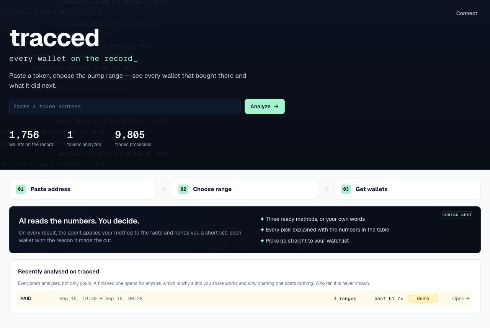
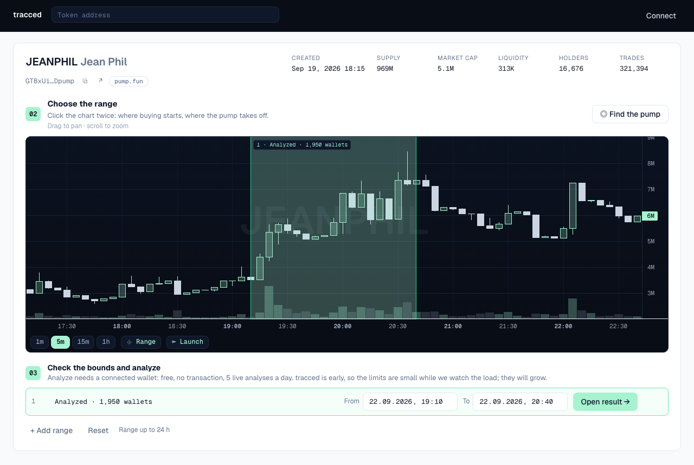
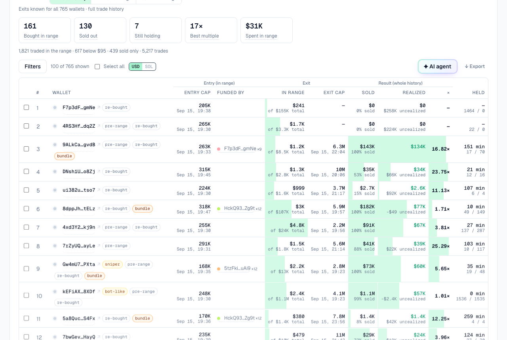
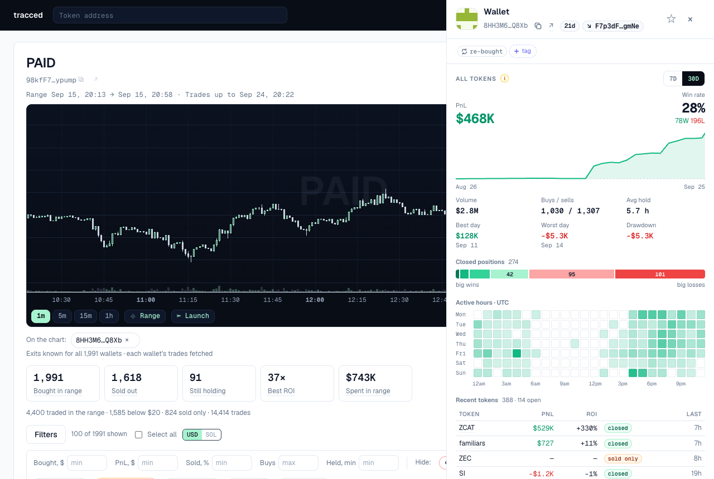

# tracced

**Every wallet on the record.** Paste a Solana token, mark the pump on the chart, and read every wallet that
bought inside that range. Entry and exit market cap, invested, realized, hold time, who funded it. Every number is
a swap you can open on Solscan. No scores, no "smart money" labels.

Live, no sign-up: **[tracced.xyz](https://tracced.xyz)** · Docs: **[tracced.xyz/docs](https://tracced.xyz/docs)**



## Three steps

1. **Paste a token.** Its whole life loads as a market-cap chart.
2. **Mark the range.** Two clicks: where buying starts, where the pump takes off. Detected pumps are offered as hints.
3. **Read the wallets.** Everyone who bought inside it, with what they paid, sold and still hold. Export CSV, TXT or JSON.

Looking is free: the demo, every finished result, the chart of any token. A new analysis needs a connected wallet
(a signed message, no transaction, no fee) and counts against a daily allowance per person: the wallet and the
browser count together, one network has its own count, and all of them reset at midnight UTC.
[Limits →](https://tracced.xyz/docs/limits)





## Why it is different

A terminal ranks the winners. tracced lists everyone who was inside the range you chose, winners and losers
together, which is the only way a group of wallets sharing one funder becomes visible.
[How it compares to Axiom and GMGN →](https://tracced.xyz/docs/compare)

Tags are rules, not opinions: `sniper`, `fresh`, `bundle`, `transfer-in` and six more, each with a definition you
can read and check. [Every rule →](https://tracced.xyz/docs/tags)

Amounts read in dollars or in SOL. Both come from the same swap, so nothing is converted at a rate, and profit
uses the cost basis of what was actually sold in both units. [Where the numbers come from →](https://tracced.xyz/docs/how-it-works)

Click a wallet and its card shows the last 7 or 30 days on every token it traded: PnL, win rate over closed
positions, average hold, counted by tracced from the wallet's own swaps. When Solana Tracker knows who the wallet
is, small marks say so: a star for a KOL, its X account, the app it trades through.
[The wallet card →](https://tracced.xyz/docs/how-it-works#the-wallet-card)



Keep what you find in several named lists, tag wallets in your own words, and export a list as CSV or TXT.
[Your account →](https://tracced.xyz/docs/account)

A token's history and its wallets are read in parallel, so a busy token takes seconds, not minutes. The result page
stays light with thousands of wallets: the table arrives as numbers and the page draws the first hundred rows,
more on request, on a phone too, where each wallet becomes a card.

## Documentation

| Page | |
|---|---|
| [Overview](https://tracced.xyz/docs) | What it answers and how to read it |
| [How it works](https://tracced.xyz/docs/how-it-works) | Where every number comes from |
| [Tags](https://tracced.xyz/docs/tags) | Ten rules, each checkable on chain |
| [Limits](https://tracced.xyz/docs/limits) | What is free, what needs a wallet, what it costs |
| [Your account](https://tracced.xyz/docs/account) | Sign-in, lists, your own tags, repeats |
| [Compare](https://tracced.xyz/docs/compare) | Next to Axiom and GMGN |
| [Roadmap](https://tracced.xyz/docs/roadmap) | Shipped, next, and what we will not build |
| [The project](https://tracced.xyz/docs/project) | Why it exists and what it refuses to do |

Pages are markdown in [`docs/`](docs/), served by the app itself, so a page changes in the same commit as the
thing it describes. Order, labels and icons are the `PAGES` list in `tracced/web/docs.py`; a file that is not
there is simply not published. Limits in the text are rendered from the live settings, so they cannot drift.

## Run it

```bash
cp .env.example .env            # SOLANATRACKER_API_KEY, plus WEB_SECRET (openssl rand -hex 32) so sign-ins survive restarts
docker compose up -d --build    # http://127.0.0.1:8095
```

Tests:

```bash
docker compose run --rm --no-deps -v "$PWD/tests:/app/tests" web python -m unittest discover -s tests -t .
```

On a server: [deploy/README.md](deploy/README.md), one container behind an existing Caddy. Quotas and costs live
in `config.yaml` under `early:` (`early.plan: free | advanced` sets the request caps for the Solana Tracker plan);
defaults are in `tracced/early/settings.py`. Version: `__version__` in `tracced/__init__.py`, shown in the footer
as `v0.4`, bumped on every release to `main`.

## Demo token

Run a finished analysis through `scripts/capture_demo.py` (the docstring has the docker command; several analyses
of one token become several demo ranges). It writes `output/early/demo/<mint>.json` and prints the
`early.demo_job` / `early.example_job` lines for `config.yaml`. Pasting that token then replays the whole flow,
chart and terminal and result, without a single request to the data provider.

## Data

- Swaps and candles: [Solana Tracker Data API](https://www.solanatracker.io/data-api). Free plan: 2,500 requests a
  month at 3 per second; Pro: 1,000,000 a month, no rate limit, and both the token's history (cut into time
  pieces, since the cursor is a time) and the wallets' own trades are fetched eight at a time (`st_concurrency`).
  A cached analysis costs none. The balance is checked at most every 10 minutes and new runs wait when the month
  gets close to its end.
- The wallet card: the wallet's swaps on every token (`/wallet/{owner}/trades`), run through the same ledger as the
  table. Who a wallet is comes from Solana Tracker's wallet summaries (`/v2/pnl/wallets/batch`, 100 wallets a
  request), asked in the background once the table is on screen; only the identity is used, for names and marks,
  never their PnL or tags.
- Wallet age and funder: a Solana RPC node with full history, [Helius](https://www.helius.dev) in production
  (`SOLANA_RPC_URL`). A wallet's first transaction is its age; the SOL that arrived in it names the funder. A busy
  wallet's first transaction comes from Helius's oldest-first method in one call instead of paging back through
  tens of thousands; a wallet an app pays fees for is searched for its first SOL among its first hundred
  transactions. Every wallet in the table is checked in the background, reading its history back from its first
  buy in the range: one page settles `fresh` for almost every wallet (1-2 credits). The first 200 by PnL
  (`age_full_top`) are also read to their first transaction and searched for an app wallet's first SOL; any other
  wallet gets that when its card is opened. The credits are counted per month (`rpc_credits_month`, tracced's share
  of the account) and the check pauses near the limit. Without a node the public `api.mainnet-beta` is used, and only
  the first 200 wallets by PnL are checked automatically.
- Paid DexScreener profiles on the chart: DexScreener's public orders endpoint, free and without a key, kept a day.
- The AI agent: any OpenAI-compatible endpoint (`ASSISTANT_*` in `.env`), with per-wallet, per-guest and site-wide daily limits.
- Nothing else: no third-party PnL, scores or "smart money" labels.

## License

MIT
