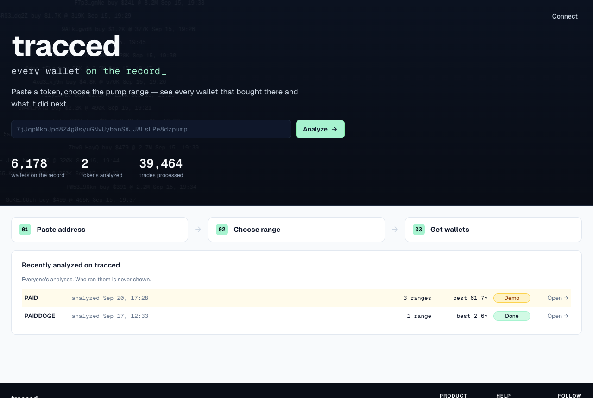
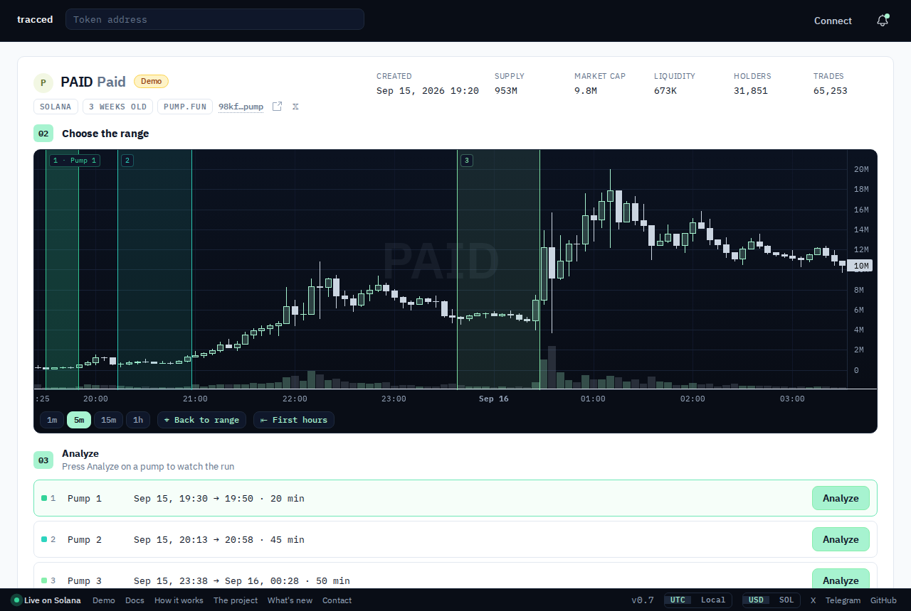
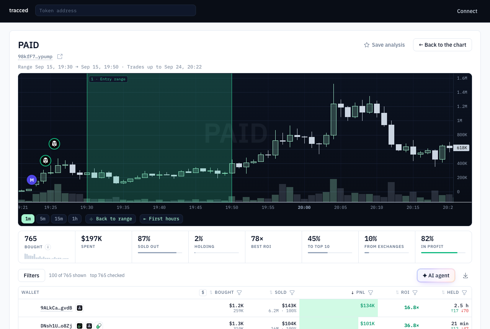
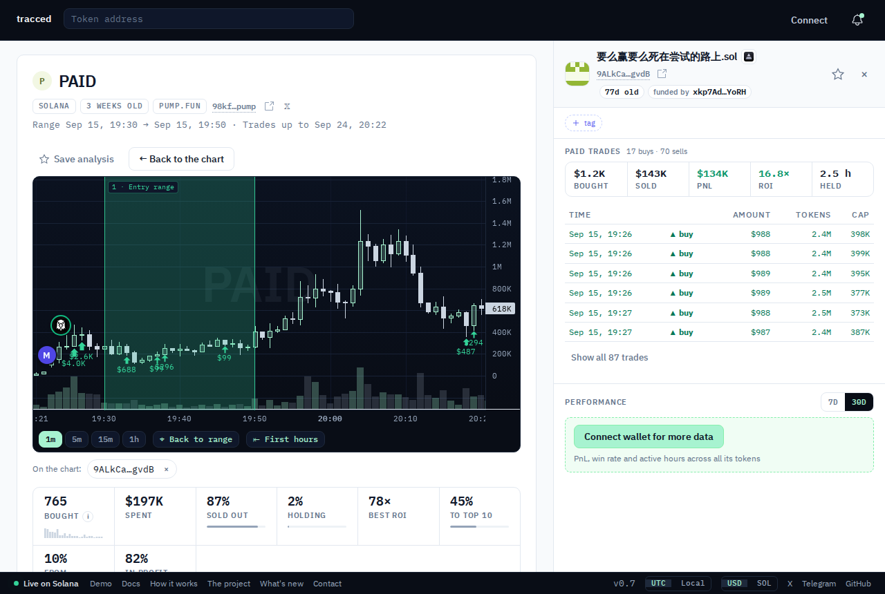
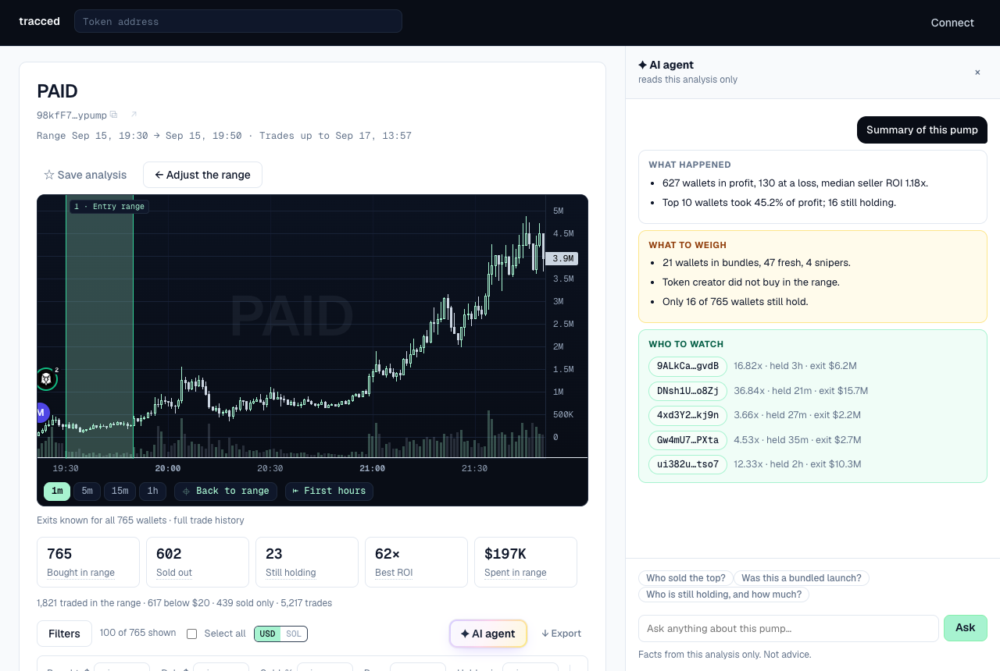

# tracced

**Every wallet on the record.** Paste a Solana token, mark the pump on the chart, and read every wallet that
bought inside that range. Entry and exit market cap, invested, realized, hold time, who funded it. Every number is
a swap you can open on Solscan. No scores, no "smart money" labels.

Live, no sign-up: **[tracced.xyz](https://tracced.xyz)** · Docs: **[tracced.xyz/docs](https://tracced.xyz/docs)**

Built for the Colosseum Crypto World's Fair, 2026. [Why it exists →](https://tracced.xyz/docs/project)



## Three steps

1. **Paste a token.** Its whole life loads as a market-cap chart.
2. **Mark the range.** Two clicks: where buying starts, where the pump takes off. A first visit shows the two clicks on
   the chart itself. The home page runs the last two days' fresh pumps to start from.
3. **Read the wallets.** Everyone who bought inside it, with what they paid, sold and still hold. Export CSV, TXT or JSON.

Looking is free: the demo, every finished result, the chart of any token. A new analysis needs a connected wallet:
Phantom, Backpack or Solflare, a signed message, no transaction, no fee. It counts against a daily allowance per person:
the wallet and the browser count together, one network has its own count, and all of them reset at midnight UTC.
[Limits →](https://tracced.xyz/docs/limits)





## Why it is different

A terminal ranks the winners. tracced lists everyone who was inside the range you chose, winners and losers
together, which is the only way a group of wallets sharing one funder becomes visible.
[How it compares to Axiom and GMGN →](https://tracced.xyz/docs/compare)

Tags are rules, not opinions: `sniper`, `fresh`, `dormant`, `bundle`, `never-sold` and four more, each with a
definition you can read and check. [Every rule →](https://tracced.xyz/docs/tags)

Amounts read in dollars or in SOL. Both come from the same swap, so nothing is converted at a rate, and profit
uses the cost basis of what was actually sold in both units. [Where the numbers come from →](https://tracced.xyz/docs/how-it-works)

Click a wallet and its card shows the last 7 or 30 days on every token it traded: PnL, win rate over closed
positions, average hold, counted by tracced from the wallet's own swaps. When the wallet is publicly identified,
small marks say so: a star for a KOL, its X account, the app it trades through. Any of its recent tokens opens
its own chart right in the card, with the wallet's buys and sells on it.
[The wallet card →](https://tracced.xyz/docs/how-it-works#the-wallet-card)



With a wallet connected, the AI agent answers questions about the analysis on the page: who sold the top, whether
it was a bundled launch, who is still holding, or anything in your own words. A summary gives three short cards:
what happened in the range, what to weigh, and whose wallets stand out. A wallet it names opens its card. Every
number it writes is checked against the table before you see it, and it answers nothing but the analysis.
[The AI agent →](https://tracced.xyz/docs/how-it-works#the-ai-agent)



Keep what you find in your watchlist, in several named lists, tag wallets in your own words, and export a list as CSV or TXT. In a closed
test, a bell on a wallet, or on a whole list, sends its buys and sells to Telegram about two seconds after the block,
and each row counts the wallet's trades of the last 7 days. [Your account →](https://tracced.xyz/docs/account)

A busy token takes seconds, not minutes. The result page stays light with thousands of wallets: the table arrives
as numbers and the page draws the first hundred rows, more on request, on a phone too, where each wallet becomes a
card.

## Documentation

| Page | |
|---|---|
| [Overview](https://tracced.xyz/docs) | What it answers and how to read it |
| [How it works](https://tracced.xyz/docs/how-it-works) | Where every number comes from |
| [Tags](https://tracced.xyz/docs/tags) | Nine rules, each checkable on chain |
| [Limits](https://tracced.xyz/docs/limits) | What is free, what needs a wallet, the daily caps |
| [Your account](https://tracced.xyz/docs/account) | Sign-in, the watchlist, your own tags, repeats |
| [Compare](https://tracced.xyz/docs/compare) | Next to Axiom and GMGN |
| [API](https://tracced.xyz/docs/api) | A token check for partners, in beta: rules and levels, no scores |
| [Roadmap](https://tracced.xyz/docs/roadmap) | Shipped, next, and what we will not build |
| [The project](https://tracced.xyz/docs/project) | Why it exists and what it refuses to do |

Pages are markdown in [`docs/`](docs/), served by the app itself, so a page changes in the same commit as the
thing it describes.

## Run it

```bash
cp .env.example .env            # fill in the keys it lists
docker compose up -d --build    # http://127.0.0.1:8095
```

Tests:

```bash
docker compose run --rm --no-deps -v "$PWD/tests:/app/tests" web python -m unittest discover -s tests -t .
```

## Data and privacy

The table is built from swaps recorded on chain. No third-party PnL, scores or "smart money" labels. A funder's
exchange name comes from our own list of exchange wallets; InsightX labels tell which of the other funders are
exchanges or apps. What is
recorded about a connected wallet is spelled out in [Your account](https://tracced.xyz/docs/account#what-we-record).

## Contact

Updates on X: [@tracced_xyz](https://x.com/tracced_xyz). A bug, an idea, a question:
[tracced.xyz/feedback](https://tracced.xyz/feedback).

## License

MIT. Bundled with it: the IBM Plex fonts (SIL Open Font License, `tracced/web/static/fonts/LICENSE-IBM-Plex.txt`), the
Geist fonts kept as the way back (SIL Open Font License, `tracced/web/static/fonts/LICENSE-Geist.txt`) and IBM Carbon
icons (Apache License 2.0, `tracced/web/static/LICENSE-Carbon-icons.txt`).
